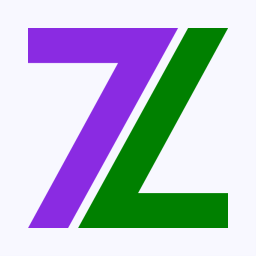

# Zyxir Logo

The source files of my personal logo, under version control.

Current Version: 1.5 | [CC-BY-SA-4.0](https://creativecommons.org/licenses/by-sa/4.0/)

| Variants | `normal`             | `favicon`                    | `monochrome`             |
|----------|----------------------|------------------------------|--------------------------|
| Picture  |  |         |  |
| Info     | The normal version   | Used as favicon for websites | Black and white version  |

## Design

The core of the logo is a big `Z` (my favorite letter), which consists of two `7`s (my favorite number).

The list of my personal colors:

-  `#008000` *green* - representing hope and being organized.
-  `#8a2be2` *blueviolet* - representing speed, exploring, and hacking to me.

Other colors:

-  `#f8f8ff` *ghostwhite* - alternative to white as a background color.
